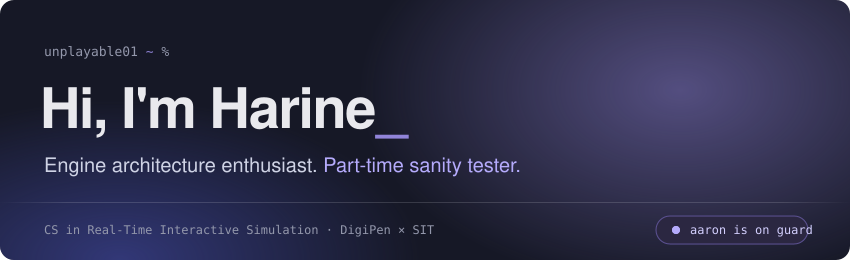
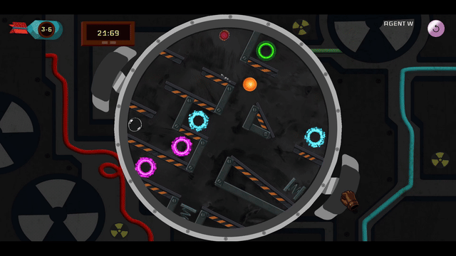
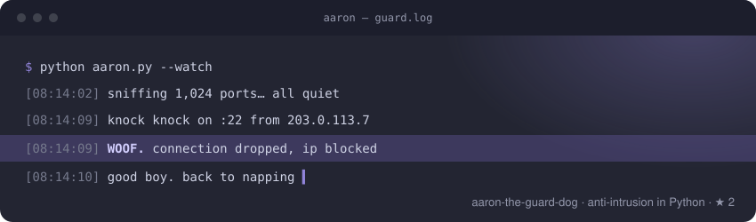

### About me

I'm a Computer Science in Real-Time Interactive Simulation student at **DigiPen × Singapore Institute of Technology**, fascinated by the mechanics underneath software: engines, systems, and the math that holds them together.

I started out in **Electronic & Computer Engineering at Ngee Ann Polytechnic**, then switched lanes because I kept wanting to know how the software on top of the hardware actually worked. These days I bounce between C/C++ and Go when I want speed, Python when I want to ship, and TypeScript when there's a UI involved.

My secret weapon is **patience**. Whether it's a gnarly bug, an algorithm that won't behave, or a friend stuck on calculus, I'll sit with it until it clicks.

### Things I've built

**💣 [TiltTiltBoom!](https://games.digipen.edu/games/tilt-tilt-boom)** · *Technical Lead & Composer* 
A published puzzle game where you tilt the whole level to defuse a bomb. I architected our custom engine, **TTBEngine**, to be modular and flexible enough to keep up with a changing design, and I also wrote the soundtrack, so I got to shape both how the game works and how it feels. 
🎮 [Play it here](https://games.digipen.edu/games/tilt-tilt-boom)

**🐕 [aaron-the-guard-dog](https://github.com/unplayable01/aaron-the-guard-dog)** · *in progress* 
Anti-intrusion software written in Python. Aaron watches my screen so I don't have to.

### What I'm into

- 🧱 Game engine architecture and real-time systems
- 📐 Where mathematical theory meets practical implementation
- 🧹 Making logic cleaner and faster, one refactor at a time
- 🎵 Writing music for the things I build

### Tech stack

### Say hi

Open to internships and collaborations, especially anything engine-, systems-, or simulation-shaped.

