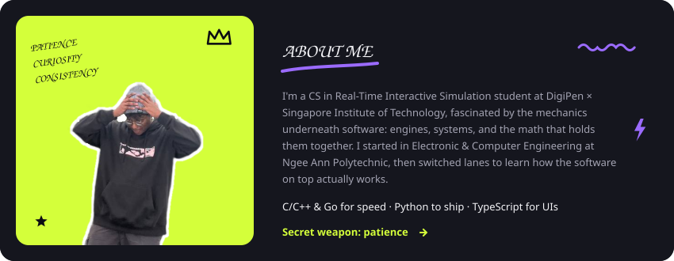

<picture>
<source media="(prefers-color-scheme: dark)" srcset="hero2-dark.svg" />
<source media="(prefers-color-scheme: light)" srcset="hero2-light.svg" />

</picture>

<a href="https://games.digipen.edu/games/tilt-tilt-boom"><picture><source media="(prefers-color-scheme: dark)" srcset="btn-play-dark.svg" /><source media="(prefers-color-scheme: light)" srcset="btn-play-light.svg" /></picture></a>&nbsp;&nbsp;<a href="https://github.com/unplayable01?tab=repositories"><picture><source media="(prefers-color-scheme: dark)" srcset="btn-projects-dark.svg" /><source media="(prefers-color-scheme: light)" srcset="btn-projects-light.svg" /></picture></a>

<a href="https://github.com/unplayable01?tab=repositories"><picture><source media="(prefers-color-scheme: dark)" srcset="projects-header-dark.svg" /><source media="(prefers-color-scheme: light)" srcset="projects-header-light.svg" /></picture></a>

<picture><source media="(prefers-color-scheme: dark)" srcset="skills-dark.svg" /><source media="(prefers-color-scheme: light)" srcset="skills-light.svg" /></picture>
<picture><source media="(prefers-color-scheme: dark)" srcset="about-dark.svg" /><source media="(prefers-color-scheme: light)" srcset="about-light.svg" /></picture>
<picture><source media="(prefers-color-scheme: dark)" srcset="footer-dark.svg" /><source media="(prefers-color-scheme: light)" srcset="footer-light.svg" /></picture>

<a href="mailto:harinesumen@gmail.com"><picture><source media="(prefers-color-scheme: dark)" srcset="btn-email-dark.svg" /><source media="(prefers-color-scheme: light)" srcset="btn-email-light.svg" /></picture></a>&nbsp;&nbsp;<a href="https://www.linkedin.com/in/harinesumen/"><picture><source media="(prefers-color-scheme: dark)" srcset="btn-linkedin-dark.svg" /><source media="(prefers-color-scheme: light)" srcset="btn-linkedin-light.svg" /></picture></a>

